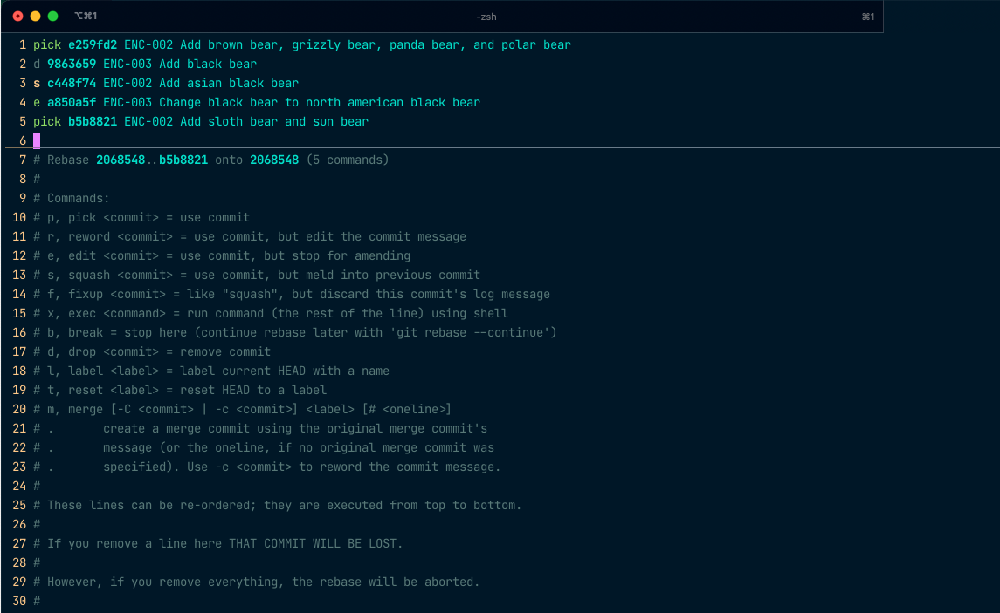
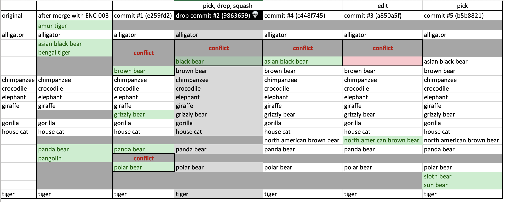
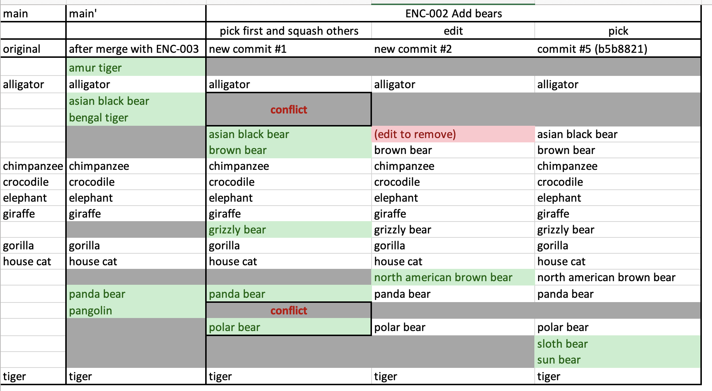

# git-rebase-practice

In order to be able to see the git log as a nice tree from your command line, edit your global gitconfig at `~/.gitconfig` and add the following line in the `[alias]` section:

```shell
[alias]
lg = !clear && git log --all --graph --pretty='format:%C(auto)%h%d %s  %C(magenta)[%an] (%ad)%C(reset)' --date=format:'%d.%m.%y %H:%M'
```

To start out with, our repository looks like this:

```shell
$ git lg

* b5b8821 (origin/ENC-002_Add-bears, ENC-002_Add-bears) ENC-002 Add sloth bear and sun bear  [Sonja Heins] (26.11.21 12:59)
* c448f74 ENC-002 Add asian black bear  [Sonja Heins] (26.11.21 12:23)
* a850a5f ENC-003 Change black bear to north american black bear  [Sonja Heins] (26.11.21 12:22)
* 9863659 ENC-003 Add black bear  [Sonja Heins] (26.11.21 12:21)
* e259fd2 ENC-002 Add brown bear, grizzly bear, panda bear, and polar bear  [Sonja Heins] (26.11.21 12:16)
| * e561890 (origin/ENC-004_Add-insects, ENC-004_Add-insects) ENC-004 Add wasp to list of animals to write about  [Sonja Heins] (26.11.21 12:27)
| * 603d036 ENC-004 Add bee  [Sonja Heins] (26.11.21 12:27)
|/
| * fec3be0 (HEAD -> main, origin/main, origin/HEAD, origin/ENC-003_Add-asian-animals) ENC-003 Add amur tiger and bengal tiger  [Sonja Heins] (26.11.21 12:25)
| * 554497b ENC-003 Add asian black bear, panda bear, pangolin  [Sonja Heins] (26.11.21 12:19)
|/
* 11d67e9 ENC-001 Add more animals to animals-to-write-about.md  [Sonja Heins] (26.11.21 12:14)
* 702965f ENC-001 Add list of animals to write about and folder for articles  [Sonja Heins] (26.11.21 12:12)
* eceb8e1 Initial commit  [s-heins] (26.11.21 12:09)
```

Here is the same with some highlighting from the command line:


## Exercises

1. Look at how the main branch looked at commit `11d67e9`, the commit that the branch `ENC_002`, `ENC-003` and `ENC-004` are based on by running `git show 11d67e9`.
1. Look at what the main branch looks like at the current head, `11d67e9`, after merging `ENC_003` into main.
1. To get a bit warmed up, look at the changes introduced by the two commits in `ENC-004`. In the next step, we will want to rebase onto the new main (at `11d67e9`).
   * Can you already say where we will have some conflicts when rebasing?
   * Now do the rebase and see if you were right by first pulling main and then running `git rebase origin/main` while having `ENC-004_Add-insects` checked out.
   * When you run into conflicts, edit the file `animals-to-write-about.md` with your editor of choice to resolve them. After you are done, run `git add . && git rebase --continue`
1. Look at the changes introduced by the commits in `ENC-002`. In the next step, we will want to rebase onto the new main (at `11d67e9`).
   * Can you already say where we will have some conflicts when rebasing?
   * Now do the rebase and see if you were right by first pulling main and then running `git rebase origin/main` while having `ENC-002_Add-bears` checked out.
   * When you run into conflicts, edit the file `animals-to-write-about.md` with your editor of choice to resolve them. After you are done, run `git add . && git rebase --continue`
1. How can we avoid having to navigate multiple conflicts when rebasing `ENC-002`? Look at the `rebase` command with the interactive flag, `git rebase -i`.

## Commands to keep in mind

* `git lg` – our alias we defined in our `~/.gitconfig` to show our git history as a nice tree
* `git add .` to add all changed files to our staging area
* `git commit -m 'My message'` to commit the staged changes with a message
* `git show <commit-hash>` to show changes introduced by a certain commit
* `git rebase origin/main` to rebase a branch on the current `origin/main`
* `git rebase -i origin/main` to rebase interactively on the current `origin/main`
* `git add . && git rebase --continue` to add all changes (i.e. mark any conflicts as resolved) and continue the rebase
* `git rebase --abort` to abort a rebase

## Exercise solutions 1 – 4: Overview over repository changes

* **Exercise 1 & 2** Main branch before merging with `ENC-003` and after:
  
* **Exercise 3** Changes introduced per commit in `ENC-004`:
  
* **Exercise 4** Changes introduced per commit in `ENC-002`:
  

## Exercise 5 solution

Different strategies:

1. Squashing all commits into one ball
2. Retaining as many commits as possible while keeping merge conflicts at a minimum

If you want to try different strategies, you can do the rebase and then run `git reset --hard origin/ENC-002_Add-bears` to reset your branch and start anew.

### Squashing all commits into one

#### Alternative 1 – rebasing on main directly

* run `git rebase -i origin/main`
* a window will open in your chosen or default command line editor. Change all `pick` entries to squash (s) for all commits, then save and exit the file
* for any merge conflicts, resolve them as before and then run `git add . && git rebase --continue`

#### Stats for Alt 1 (squashing)

* Number of conflicts: **3**
  * commit 1
  * squashing commit 2 into commit 1\
  (asian black bear + bengal tiger vs black bear)
  * squashing commit 3 into new commit (1 + 2)\
  (asian black bear + bengal tiger vs removing black bear)
* Number of times editing the commit message: **5** (one for each commit)
* Number of resulting commits: **1**

#### Alternative 2 – first squashing all commits, then rebasing

* run `git rebase -i 11d67e9` to change your current branch
* as above, change all `pick` entries to `s` (squash)
* afterwards, run `git rebase -i origin/master`

#### Stats for Alt 2 (squashing)

* Number of conflicts during squash: **0**
* Number of times editing the commit message: **1**
* Number of conflicts during rebase: **1**
* Number of resulting commits: **1**

👉 It is more convenient to *first* clean up the branch and *then* rebase (1 conflict vs 3 conflicts)

### Retaining as many commits as possible

For example, you could choose this strategy:



We pick the first commit, drop the second, squash the fourth into the first, and move the third after it. We choose edit for that one so we can make sure that removing the brown bear is no longer in the list of changes and then we can reword the commit message to read "Add north american black bear". We can also retain commit #5.

Here is an illustration of our changes:



Then, our changes will look like this:



#### Alternative 1 – rebasing on main

* run `git rebase -i origin/main`
* use the above rebasing strategy (pick, d, s, e, pick and move commit `a850a5f` after `c448f74`)

#### Stats for alt 1 (retaining as many commits as possible)

* Number of conflicts: **3**
  * 1/5: commit 1\
  (asian black bear + bengal tiger vs brown bear; pangolin vs polar bear)
  * 3/5: squashing commit 4 into commit 1\
  (bengal tiger vs empty line where black bear was removed; add asian black bear)
  * 4/5: editing commit 3 into new commit to just add north american brown bear\
  (asian black bear + bengal tiger vs removing black bear)
* Number of times editing the commit message: **3** (one for each conflict)
* Number of resulting commits: **3**

#### Alternative 2 – squash, then rebase

* run `git rebase -i 11d67e9` to change your current branch
* change all `pick` entries to `s`
* afterwards, run `git rebase -i origin/master`
* use the above rebasing strategy (pick, s, s, e, pick and move commit `a850a5f` after `c448f74`)

#### Stats for alt 2 (retaining as many commits as possible)

* Number of conflicts during squash: **1**\
(4/5: asian black bear vs removing black bear)
* Number of times editing the commit message: **2** (1/5 & 4/5)
* Number of conflicts during rebase: **1**\
(1/3: bengal tiger vs brown bear; pangolin vs polar bear)
* Number of resulting commits: **3**

👉 It is more convenient to *first* clean up the branch and *then* rebase (2 conflicts vs 3 conflicts)

## Conclusion

* It is best to keep your commit history clean while working on the branch because it is a lot more work to clean it up afterwards
  * while working, try to separate your work into distinct steps after each of which the tests will still run
  * if you add more work, think about whether something should be a separate commit. If you forgot to run linting or are just fixing some tests, this should go in the same commit as before
  * amend your previous commit by running `git add . && git commit --amend` (if you don't want to change the commit message, use `--no-edit` as well)
* Commits only serve a purpose if they help the person viewing them understand what happened in a line of work. If you're going over the same piece of code multiple times, to first change it to work one way and then another within the same branch, think about whether retaining those commits will help the reader. More often than not, the answer is no. If so, squash those commits to keep the noise at a minimum.
