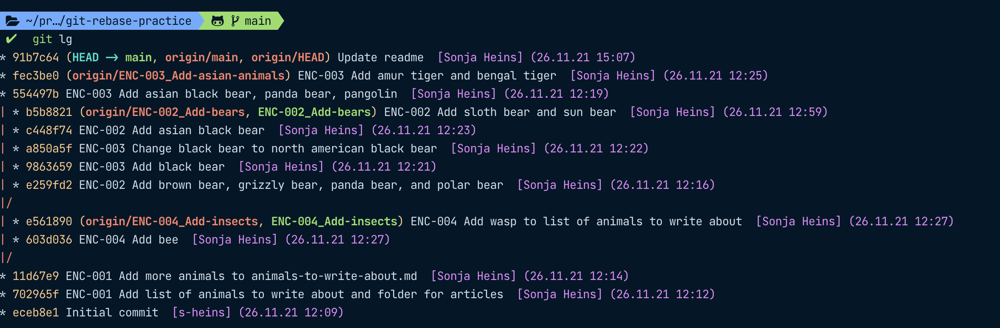
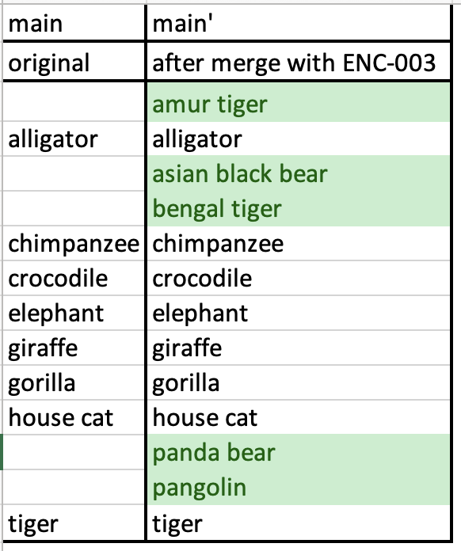
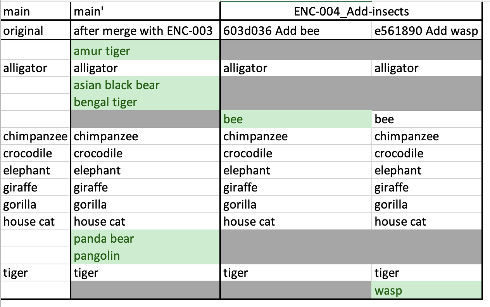
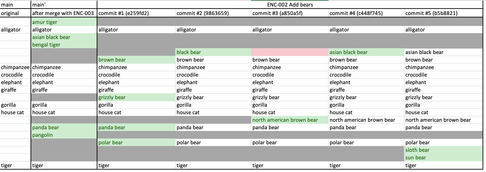

# git-rebase-practice

In order to be able to see the git log as a nice tree from your command line, edit your global gitconfig at `~/.gitconfig` and add the following line in the `[alias]` section:

```shell
[alias]
lg = !clear && git log --all --graph --pretty='format:%C(auto)%h%d %s  %C(magenta)[%an] (%ad)%C(reset)' --date=format:'%d.%m.%y %H:%M'
```

To start out with, our repository looks like this:

```shell
$ git lg

* b5b8821 (origin/ENC-002_Add-bears, ENC-002_Add-bears) ENC-002 Add sloth bear and sun bear  [Sonja Heins] (26.11.21 12:59)
* c448f74 ENC-002 Add asian black bear  [Sonja Heins] (26.11.21 12:23)
* a850a5f ENC-003 Change black bear to north american black bear  [Sonja Heins] (26.11.21 12:22)
* 9863659 ENC-003 Add black bear  [Sonja Heins] (26.11.21 12:21)
* e259fd2 ENC-002 Add brown bear, grizzly bear, panda bear, and polar bear  [Sonja Heins] (26.11.21 12:16)
| * e561890 (origin/ENC-004_Add-insects, ENC-004_Add-insects) ENC-004 Add wasp to list of animals to write about  [Sonja Heins] (26.11.21 12:27)
| * 603d036 ENC-004 Add bee  [Sonja Heins] (26.11.21 12:27)
|/
| * fec3be0 (HEAD -> main, origin/main, origin/HEAD, origin/ENC-003_Add-asian-animals) ENC-003 Add amur tiger and bengal tiger  [Sonja Heins] (26.11.21 12:25)
| * 554497b ENC-003 Add asian black bear, panda bear, pangolin  [Sonja Heins] (26.11.21 12:19)
|/
* 11d67e9 ENC-001 Add more animals to animals-to-write-about.md  [Sonja Heins] (26.11.21 12:14)
* 702965f ENC-001 Add list of animals to write about and folder for articles  [Sonja Heins] (26.11.21 12:12)
* eceb8e1 Initial commit  [s-heins] (26.11.21 12:09)
```

Here is the same with some highlighting from the command line:



## Exercises

1. Look at how the main branch looked at commit `11d67e9`, the commit that the branch `ENC_002`, `ENC-003` and `ENC-004` are based on by running `git show 11d67e9`.
1. Look at what the main branch looks like at the current head, `11d67e9`, after merging `ENC_003` into main.
1. To get a bit warmed up, look at the changes introduced by the two commits in `ENC-004`. In the next step, we will want to rebase onto the new main (at `11d67e9`).
   * Can you already say where we will have some conflicts when rebasing?
   * Now do the rebase and see if you were right by first pulling main and then running `git rebase origin/main` while having `ENC-004_Add-insects` checked out.
   * When you run into conflicts, edit the file `animals-to-write-about.md` with your editor of choice to resolve them. After you are done, run `git add . && git rebase --continue`
1. Look at the changes introduced by the commits in `ENC-002`. In the next step, we will want to rebase onto the new main (at `11d67e9`).
   * Can you already say where we will have some conflicts when rebasing?
   * Now do the rebase and see if you were right by first pulling main and then running `git rebase origin/main` while having `ENC-002_Add-bears` checked out.
   * When you run into conflicts, edit the file `animals-to-write-about.md` with your editor of choice to resolve them. After you are done, run `git add . && git rebase --continue`
1. How can we avoid having to navigate multiple conflicts when rebasing `ENC-002`? Look at the `rebase` command with the interactive flag, `git rebase -i`.

## Commands to keep in mind

* `git lg` – our alias we defined in our `~/.gitconfig` to show our git history as a nice tree
* `git add .` to add all changed files to our staging area
* `git commit -m 'My message'` to commit the staged changes with a message
* `git show <commit-hash>` to show changes introduced by a certain commit
* `git rebase origin/main` to rebase a branch on the current `origin/main`
* `git rebase -i origin/main` to rebase interactively on the current `origin/main`
* `git add . && git rebase --continue` to add all changes (i.e. mark any conflicts as resolved) and continue the rebase
* `git rebase --abort` to abort a rebase

## Exercise solutions 1 – 4: Overview over repository changes

* **Exercise 1 & 2** Main branch before merging with `ENC-003` and after:
  
* **Exercise 3** Changes introduced per commit in `ENC-004`:
  
* **Exercise 4** Changes introduced per commit in `ENC-002`:
  
